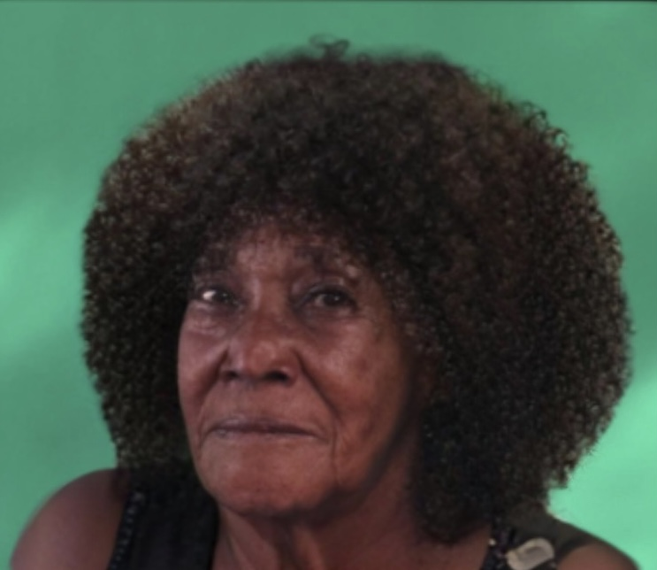

+++
title = "Ist man wirklich alleine in einem fremden Land"
date = "2023-06-01"
draft = false
pinned = false
tags = ["Migration"]
image = "unknown.jpeg"
+++
 Benet Belay (47) aus Äthiopien ist vor 10 Jahren ohne ihre Familie in die Schweiz immigriert. Mit der Familie in Äthiopien ist der Kontakt abgebrochen. Wir wollen mit Benet über ihre Gefühle, ihre Immigrations-Erfahrungen und deren Auswirkungen auf ihr Leben sprechen.\


Wir steigen in Bümpliz aus und gehen weiter, bis wir das Café vor uns sehen. Langsam und unsicher betreten wir das Café Tscharni und spüren die warme einladende Atmosphäre. Gespräche im Hintergrund dringen an unsere Ohren. Normalerweise ist es nicht üblich, dass es in diesem Restaurant eine Menge von Menschen hat, die von der Immigration betroffen sind, jedoch ist es heute anders. Eine Gruppe von Immigranten trifft sich heute in dem Café Tscharni und wir haben die Gelegenheit dabei zu sein. Vor dem Gespräch mit Benet Belay bekommen wir erst einmal einen Einblick in den Kurs, der hier wöchentlich im Café stattfindet. In dem Raum sind Frauen, die alle ähnliche Erfahrungen machen. Sie tauschen sich zuerst gegenseitig über ihr Wochenende aus, steigen danach aber direkt in den eigentlichen Kurs ein. In diesem sind pro Gruppe etwa 10 Frauen. Die Kursleiterin Vera stellt ihnen Aufgaben, die sie gemeinsam auf Deutsch lösen müssen. 

### Wir kommen mit Benet ins Gespräch

Wir suchen uns nun inmitten der Geräuschkulisse von Gesprächen und schepperndem Geschirr mit Benet einen Platz. Sie sieht gespannt aus, wirkt aber auch etwas unsicher. Wir steigen in das Gespräch mit unserer ersten Frage ein, jedoch ist das Erste was wir von ihr sehen, ein hilfloser Blick. Sie fängt an zu seufzen. Die Schweiz gehört zu den Ländern mit dem höchsten Anteil an ausländischen Personen im Land. Wir erfahren, dass der Anteil der ausländischen Wohnbevölkerung in der Schweiz besonders hoch ist (25%). Dies liegt aber auch daran, dass das Land sehr strenge Einbürgerungs-Richtlinien hat.  Die schweizerische Nationalität erhält man nur, wenn man sich gut in die Schweiz integriert und über einen langen Zeitraum dort wohnhaft ist – dies ist ein Grund, weshalb sehr viele Ausländerinnen und Ausländer ihre Staatsbürgerschaft behalten. Dies ist auch bei Benet der Fall: *«Es ist sehr schwierig in der Schweiz ohne Papiere»*,  sagt sie. Die sogenannten Immigranten besuchen meist viele verschiedene Kurse. Auch Benet besucht sie. Sobald wir das Thema “Heimatland” ansprechen, unterbricht sie unsere Disskusion und weigert sich, darüber zu sprechen. *«Es ist Vergangenheit»* sagt sie, während ihr Tränen in die Augen treten. Schnell bemerken wir, dass Benet, obwohl sie vor 10 Jahren Äthiopien verlassen hat, immer noch Schwierigkeiten hat, das Geschehene einzuordnen.

### Ihre Reise in die Schweiz

Benet erzählt uns als nächstes etwas über ihre Reise in die Schweiz, *«Ich fliege in die Schweiz mit dem Flugzeug und habe sehr viele Probleme»*, sagt sie und erklärt den genauen Grund, weshalb es als Immigrantin in erster Linie schwierig ist. Da Benet lange keine Geldquelle hatte, bedeutete dies auch, dass sie keine Wohngelegenheit hatte. Sie hatte viele verschiedene Jobs, unter anderem auch im Restaurant als Kellnerin, nachdem das Restaurant geschlossen wurde, fand sie wieder ein neuen Job. Ihr neuer Chef half ihr, indem er ihr Kleidung zur Verfügung stellte, und ihr ein guten Lohn gab, so dass sie endlich ein Zuhause hatte. Nun erscheint ein verzaubertes Lächeln auf ihrem Gesicht, was auch bei uns ein Lächeln auslöst. 

### «Es ist nicht einfach ohne Familie»

Durch ihre Erfahrungen im Service hat sie sich auch mit der Freiwilligenarbeiten auseinandergesetzt. *«Ich kam durch die Polizei darauf, eine Schweizer Polizistin hat mir gesagt, ich muss irgendwo anfangen»* erklärt sie. Sie ist nicht allein, aber einsam. Sie liess ihre Familie zurück, aber hier in der Schweiz hat sie auch keine. Der Grund, weshalb sie keine eigene Familie gegründet hat, ist einerseits die finanziellen aber auch ihre gesundheitlichen Probleme und Beschränkungen. *«Ich habe mir überlegt, eine Befruchtung zu machen, jedoch reicht mir das Geld nicht»*, begründet sie. Ihre Beziehungen zu Männern scheitern jedes Mal, nachdem sie erfahren, dass Benet keine Kinder kriegen kann. Benet beschäftigt das Thema mental sehr, *«Nun bin ich zu alt dafür»*, resümiert sie und wirft uns einen traurigen Blick zu. 

*«Ich habe sehr viele Freunde»*, betont sie überzeugt. Ihre Freunde sind vor allem Schweizer, welche sie durch Kurse und durch ihre immer abwechselnde Arbeit kennen gelernt hat. Sie bekommt sehr viel Hilfe von den SchweizerInnen, aber erlebt durch sie auch den grössten Hass. *«Rassismus ist in diesem Land sehr massiv»*, meint sie und erzählt uns von ihren Erfahrungen, was uns sehr traurig macht und auch schockiert. *«Das Leben ist nicht einfach»*. Es ist schwierig ein Leben für sich in einem ganz fremden Land aufzubauen, wenn man nicht einmal die Sprache spricht. Obwohl die Schweiz ein sehr gutes und priviligiertes Land ist, werden manche Leute immer noch diskriminiert und ausgeschlossen, nur weil sie nicht Schweizer sind.